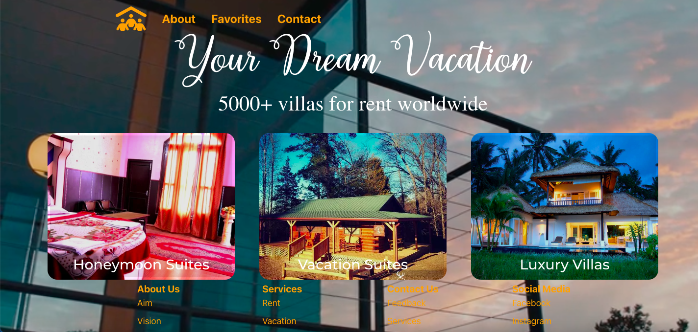

# Rent Amazing Properties Country Wide

<!-- PROJECT LOGO -->
 

  
  

## About the Project
I designed this web app for my React project at HackYourFuture journey of learning web development. This project was bootstrapped with [Create React App](https://github.com/facebook/create-react-app).
The web version of this project can be seen on [Netlify](https://property-rentals.netlify.app/).

The app fetches data from [Draftbit](https://example-data.draftbit.com/). Three types of fetches can be made:
* First option is the smaller rooms where only a couple of people can stay.
* Secondly, there is the option of having vacation rentals that are located on the country side.
* Lastly, rooms are shown in descending order of the rooms so that the biggest villas are shown first which can accommodate upto 10 people.

Foreseeable errors like failing to fetch data and unavailable data are handled such that the user can see on the screen what went wrong.

### Built With

The app was built using the knowledge gained by studying different modules of Web Development at HackYourFuture curriculum especially:

 &nbsp;&nbsp;&nbsp;&nbsp;&nbsp;&nbsp;&nbsp;&nbsp;&nbsp;&nbsp;&nbsp;&nbsp;&nbsp;&nbsp;&nbsp;&nbsp;&nbsp;&nbsp;&nbsp;&nbsp;

## Roadmap

This is a basic app that fulfills the requirements for the assignment at HackYourFuture. But I intend to keep improving upon it with the following roadmap. 

- [x] Responsive app
- [x] Use atleast one API to fetch data
- [x] Loading/error handling for the interaction with the API
- [ ] Also fetch the weather forecast depending on the location
- [ ] Additional Options
    - [ ] Sign-up
    - [ ] Offer users the opportunity to present their own place for rent like Airbnb

## Contributing

This is in no way a perfect application. I am in the process of learning and implementing knowledge. Therefore, contributions, suggestions and feedbacks are **heartily welcome**. If you have a suggestion that would make this better, please fork the repo and create a pull request. You can also simply open an issue with the tag "enhancement".
Don't forget to give the project a star! Thanks again!

1. Fork the Project
2. Create your Feature Branch (`git checkout -b feature/AmazingFeature`)
3. Commit your Changes (`git commit -m 'Add some AmazingFeature'`)
4. Push to the Branch (`git push origin feature/AmazingFeature`)
5. Open a Pull Request

## Contact

Nida ul Zafar  
 

## Acknowledgments

I would like to acknowledge a number of people and resources that helped me get through this project. 

* [Draftbit](https://example-data.draftbit.com/) For the data.
* [Geeksforgeeks](https://www.geeksforgeeks.org/) For the Nav and Footer component.
* [GetCSSScans](https://getcssscan.com/css-buttons-examples) For the beautiful button design.
* [Positronx](https://www.positronx.io/) For the contact form component.
* [FontAwesome](https://fontawesome.com/) For the cool and free icons.
* Last but not least the [HackYourFuture Team](https://github.com/HackYourFuture) for their untiring guidance and efforts.

